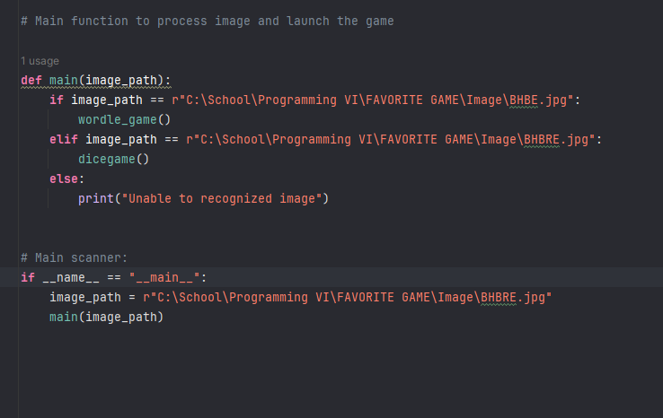

# DOCUMENTATION UPDATE 5.26.24 

Date: June 1, 2024 

Features Added/Updated Since Last Update
I had to adjust things accordingly due to be hospitalized this quarter and with permission I did just that but still grasp an understanding. I inspired to work more into tensorflow and cv on python. This was the initial libraries i learned in regards of building a facial recognition time card. With the same inspiration, i wanted to scan a particular image and it will prompt a game. 

Issues Encountered
My main scanner isn't working right now. I am doing my last touch ups before meeting with the professor.

Lessons Learned
with Tensorflow there's a model called MobileNetV2 , this is a pretrain image data set. This allows for images to be specifying by weights. I found this in stack overflow: 
def preprocess_image(image_path):
    image = cv2.imread(image_path)
    image = cv2.cvtColor(image, cv2.COLOR_BGR2RGB)
    image = cv2.resize(image, (224, 224))
    image = np.expand_dims(image, axis=0)
    image = tf.keras.applications.mobilenet_v2.preprocess_input(image)
    return image
I ended up using this in whatg i was building. This basically reads the image and converts the img to RGB b/c the img is ijnitally handles in BGR . I resize the img to 224 , 224 b/c this is the standard for MobileNetV2 in tensor flow. 

Stay up-to-date: 
I thought I already understood the concept of tensorflow and cv but im learning more and more. I just learned about Numpy is also a libary for numerical computing for large multi arrays / matrices. Im using this in my project because it allows processing for multi-images. 

Documentation is key: 
I feel like i am almost hitting the  finish line with my project. I had  set backs but I learned alot within the quarter. I really like C# but im really liking python. C# is also simple to understand but since quarter 4 I've been into studying the language more and more. My project is based on python and tackling the understanding for tensorflow and cv and other librairies that compliment these gives me a more understanding on how the computer understand ABC with images. 

Right now, I am struggling to get my main scanner to queue up the right game with the image path. As soon as i figure that , i plan on growing the project more and more. Typos are my worst enemy though, so maybe its a typo thing. My next step is to figure out why my main scanner not working and what i need to do in my conditions toi make sure it is connecting correctly. 
 
